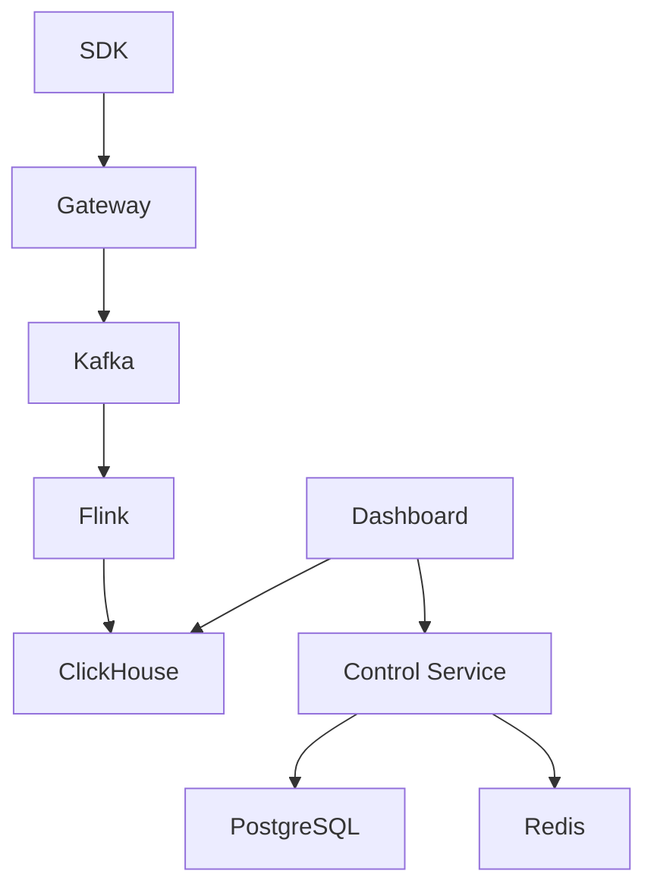

## Quick Start

```bash
# Clone the repository
git clone https://github.com/cuihairu/oddsmaker.git

# Start with Docker Compose
cd oddsmaker
docker-compose up -d

# Access the API
curl http://localhost:8085/actuator/health
```

## Architecture



## Key Features

### 🎮 Multi-Game Support
Manage multiple games with isolated environments, API keys, and configurations.

### 📊 Real-time Processing
Process millions of events per second with Kafka + Flink + ClickHouse pipeline.

### 🛡️ Risk Control
Detect and prevent cheating, payment fraud, and other suspicious activities.

### 🧪 A/B Testing
Run experiments with statistical significance testing and SRM detection.

### 🤖 Machine Learning
Deploy and manage ML models for predictions and anomaly detection.

### 🔐 Enterprise Security
MFA, SSO, RBAC, audit logging, and compliance features.

## Documentation

- [Getting Started](/guide/) - Quick start guide
- [API Reference](/reference/) - Complete API documentation
- [Operations](/operations/) - Deployment and operations guides
- [Architecture](/guide/architecture) - System architecture overview

## Community

- [GitHub Issues](https://github.com/cuihairu/oddsmaker/issues) - Report bugs and request features
- [Discussions](https://github.com/cuihairu/oddsmaker/discussions) - Ask questions and share ideas

## License

Oddsmaker is released under the [MIT License](https://opensource.org/licenses/MIT).
